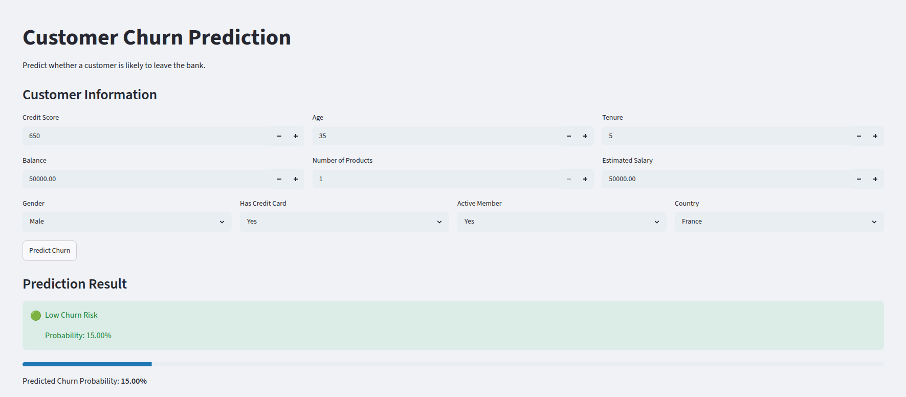
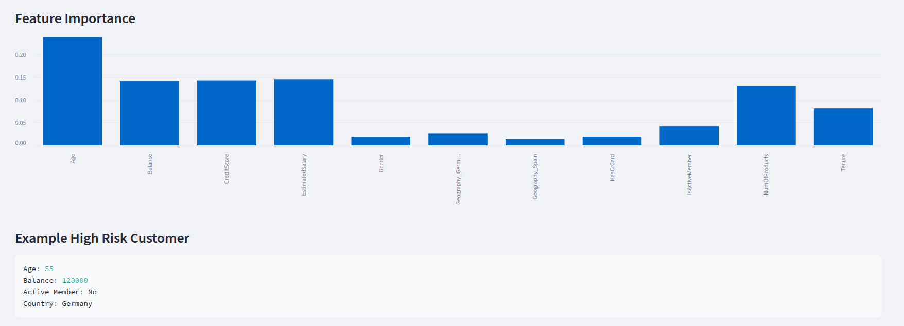

# Customer Churn Prediction System

A Machine Learning powered customer churn prediction system that identifies customers who are likely to leave a bank based on demographic, financial, and account activity information.

The project uses supervised machine learning techniques to analyze customer behavior patterns and predict churn risk, enabling businesses to proactively retain valuable customers.

Built using Python, Scikit Learn, Random Forest, and Streamlit.

---

## Features

- Customer Churn Prediction

- Churn Probability Score

- Risk Classification (Low, Medium, High)

- Interactive Streamlit Web Application

- Feature Importance Analysis

- Real Time Predictions

- Business Focused Insights

---

## Tech Stack

### Machine Learning

* Python
* Pandas
* NumPy
* Scikit Learn

### Algorithms

* Logistic Regression
* Random Forest Classifier

### Deployment

* Streamlit

---

## Dataset

Bank Customer Churn Dataset

The dataset contains customer information including:

* Credit Score
* Geography
* Gender
* Age
* Tenure
* Account Balance
* Number of Products
* Credit Card Ownership
* Active Membership Status
* Estimated Salary

Target Variable:

* Exited (0 = Customer Stayed, 1 = Customer Left)

Dataset Size:

* 10,000 Customers

---

## Machine Learning Pipeline

### 1. Data Preprocessing

* Removed irrelevant columns
* Handled categorical features
* Performed feature encoding
* Applied feature scaling

### 2. Exploratory Data Analysis

Analyzed relationships between customer attributes and churn behavior.

Key findings:

* Older customers were more likely to churn.
* Customers with higher balances showed increased churn rates.
* Inactive members were significantly more likely to leave.

### 3. Feature Engineering

Applied:

* Label Encoding
* One Hot Encoding
* Standard Scaling

### 4. Model Development

Implemented and evaluated multiple classification models:

#### Logistic Regression

* Accuracy: 81.1%
* Churn Recall: 20%

#### Random Forest Classifier

* Accuracy: 86.55%
* Churn Recall: 47%

### 5. Model Selection

Random Forest was selected as the final model due to significantly better churn detection performance.

---

## Results

### Final Model Performance

| Metric    | Score |
| --------- | ----- |
| Accuracy  | 86.55% |
| Precision | 75%   |
| Recall    | 47%   |
| F1 Score  | 58%   |

The model successfully improved churn detection compared to the baseline Logistic Regression model.

---

## Key Business Insights

Feature importance analysis revealed that the strongest predictors of customer churn were:

* Age
* Account Balance
* Customer Activity Status
* Credit Score
* Number of Banking Products

These insights can help businesses design targeted customer retention strategies.

---

## Project Structure

```text
CustomerChurnPrediction/
│
├── app.py
├── churn.ipynb
├── model.pkl
├── scaler.pkl
├── Churn_Modelling.csv
├── requirements.txt
├── README.md
└── .gitignore
```

---

## Installation

Clone the repository:

```bash
git clone <repository-url>
cd CustomerChurnPrediction
```

Create a virtual environment:

```bash
python -m venv ml-env
```

Activate the environment:

Linux / macOS

```bash
source ml-env/bin/activate
```

Windows

```bash
ml-env\Scripts\activate
```

Install dependencies:

```bash
pip install -r requirements.txt
```

---

## Run the Application

```bash
streamlit run app.py
```

Open:

```text
http://localhost:8501
```

---

## Application Preview




---

## Example Prediction

### Input

* Age: 55
* Balance: ₹120,000
* Active Member: No
* Credit Score: 650

### Output

🔴 High Churn Risk

Probability: 82%

---

## Future Enhancements

* XGBoost Model Integration
* Hyperparameter Tuning
* ROC Curve Visualization
* SHAP Explainability
* Customer Segmentation
* Cloud Deployment
* Batch Prediction Support

---

## Learning Outcomes

This project provided practical experience in:

* Data Cleaning and Preprocessing
* Exploratory Data Analysis
* Feature Engineering
* Classification Algorithms
* Model Evaluation
* Feature Importance Analysis
* Machine Learning Deployment
* Streamlit Application Development

---

## Author

**Mugdha Challa**

